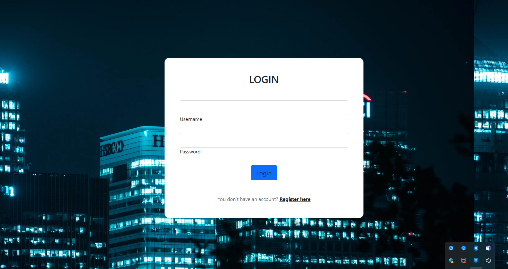
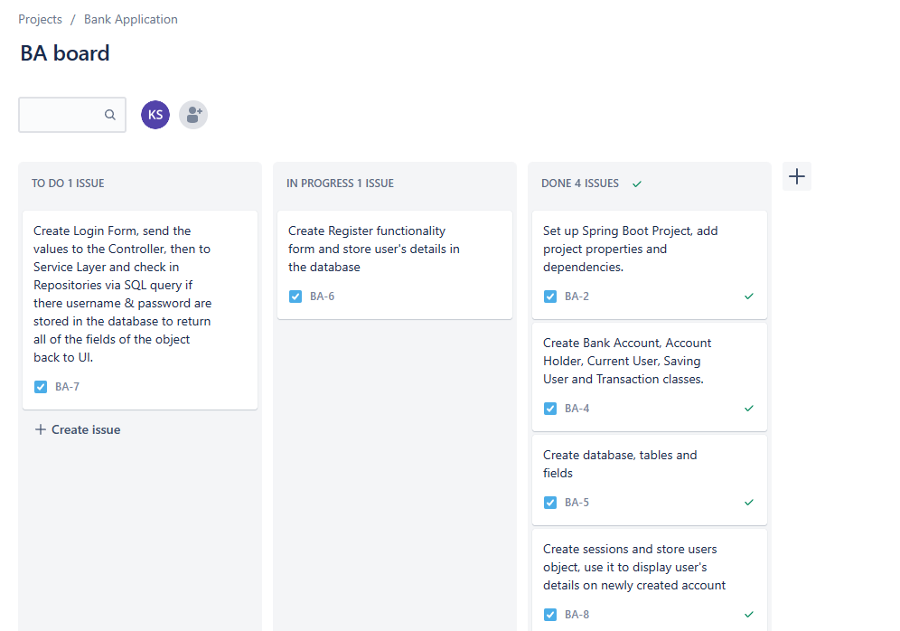

<h1 align ="center"> Banking Application </h1>
<h4 align ="center">  Backend Development on Java and Spring Boot. </h4>

This is a Banking Web Application utilises Java, Spring MVC and JPA repository, microservices and RESTfull API. This projects serves educational purposes as demostrates
pioneer's skills on Java Developmnet.

## Features

- Login Form
- Register Form
- Create Current Account
- Create Saving Account
- List all Current Accounts
- List all Saving Accounts
- Update Account
- Make Transactions
- View Transactions History
- Make deposit
- Make withdrawal

## Technologies Used

- Java 11
- Bootstrap 5.2
- Jira and Confluence was used throughout the building process of the application for tracking the progress and planning the next steps.

## Environment

- Eclipse

### Making a Local Clone

1. Log in to the [GitHub Repository](https://github.com/kpashindla25/banking-application-KonstantinaStrantzali).
2. Click "Code" above the list of files, where you can Clone or Download the repository.
3. To clone using HTTPS click the clipboard symbol under "Clone with HTTPS".
4. Open Git Bash.
6. Current working directory needs to be changed to the new location, where you want the cloned directory to be.
7. Type `git clone`, and then paste the URL copied in Step 3.
8. Press Enter, to create the local clone.
9. Run the project on you IDE
